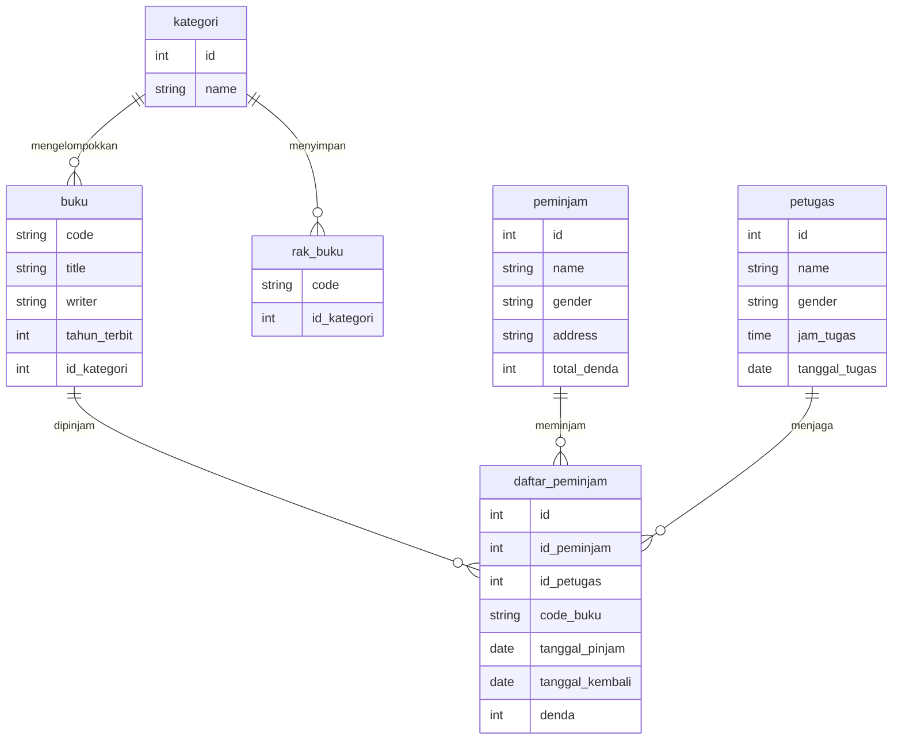

```mermaid
erDiagram
    buku {
        string code
        string title
        string writer
        int tahun_terbit
        int id_kategori
    }

    kategori {
        int id
        string name
    }

    rak_buku {
        string code
        int id_kategori
    }

    petugas {
        int id
        string name
        string gender
        time jam_tugas
        date tanggal_tugas
    }

    peminjam {
        int id
        string name
        string gender
        string address
        int total_denda
    }

    daftar_peminjam {
        int id
        int id_peminjam
        int id_petugas
        string code_buku
        date tanggal_pinjam
        date tanggal_kembali
        int denda
    }

    buku ||--o{ daftar_peminjam : "dipinjam"
    peminjam ||--o{ daftar_peminjam : "meminjam"
    petugas ||--o{ daftar_peminjam : "menjaga"
    kategori ||--o{ buku : "mengelompokkan"
    kategori ||--o{ rak_buku : "menyimpan"

```