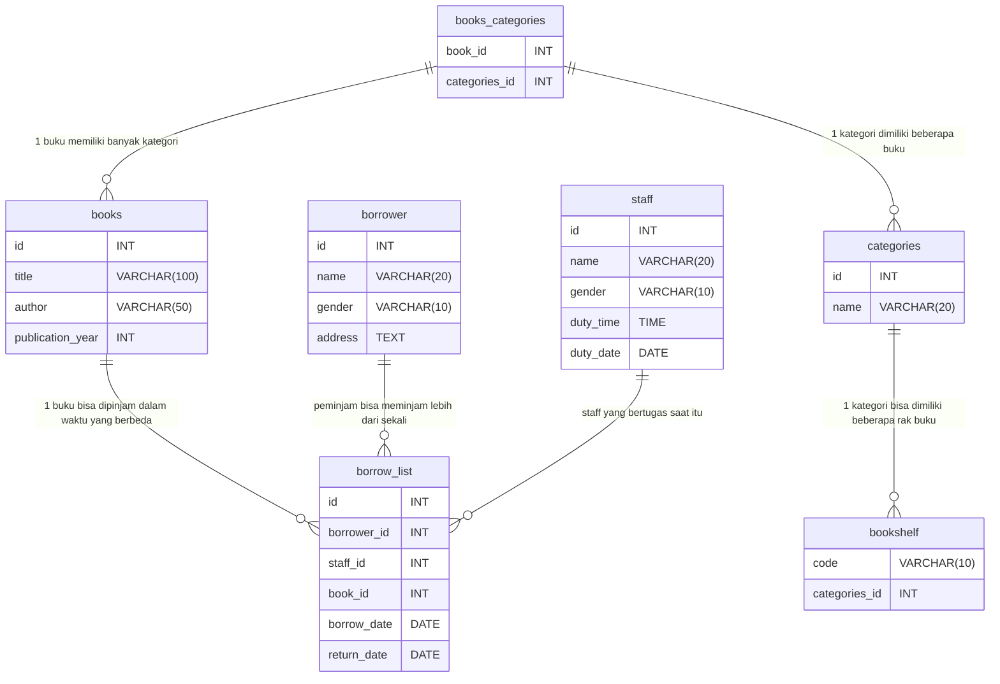

```mermaid
erDiagram
    staff {
       id INT
       name VARCHAR(20)
       gender VARCHAR(10)
       duty_time TIME
       duty_date DATE
    }

    borrower {
        id INT 
        name VARCHAR(20)
        gender VARCHAR(10)
        address TEXT
    }

    categories {
        id INT
        name VARCHAR(20)
    }

    books_categories {
        book_id INT
        categories_id INT
    }

    bookshelf {
        code VARCHAR(10)
        categories_id INT
    }

    books {
        id INT
        title VARCHAR(100)
        author VARCHAR(50)
        publication_year INT
    }

    borrow_list {
        id INT
        borrower_id INT
        staff_id INT
        book_id INT
        borrow_date DATE
        return_date DATE
    }

    books ||--o{ borrow_list : "1 buku bisa dipinjam dalam waktu yang berbeda"
    borrower ||--o{ borrow_list : "peminjam bisa meminjam lebih dari sekali"
    staff ||--o{ borrow_list : "staff yang bertugas saat itu"
    categories ||--o{ bookshelf : "1 kategori bisa dimiliki beberapa rak buku"

    books_categories ||--o{ books : "1 buku memiliki banyak kategori"
    books_categories ||--o{ categories : "1 kategori dimiliki beberapa buku"

```

## FEATURE

- ERD gambaran umum tentang struktur database
- UP : sql for  create table
- DOWN : sql for delete table
- SEED : sql for insert field table